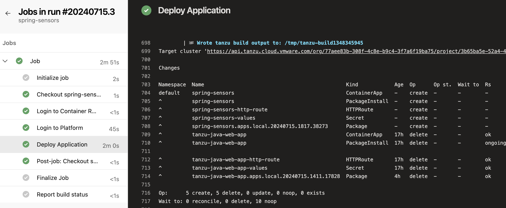
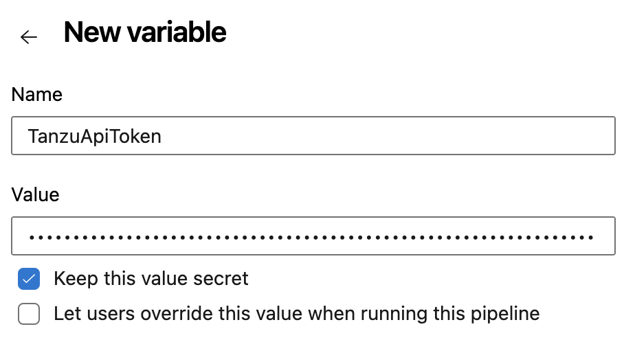
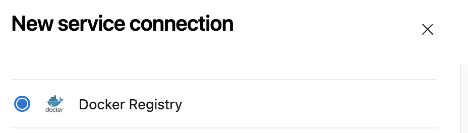

# Tanzu Deploy Azure DevOps Pipeline

### About

ADO Pipeline to deploy your application to Tanzu Platform for Kubernetes

### Prerequisites

To use this action with your application, you must have the following:

**Tanzu API Token.** Generate a token that the action will use to authenticate with Tanzu Platform. See [How to generate a Tanzu API Token](tanzu-api-token.md).

**ContainerApp configuration.** In the root of your application directory, run `tanzu app init` to generate a default configuration in the `.tanzu/config` subfolder. If you want to deploy other resources with your application, like an `HttpRoute`, add those to the `.tanzu/config` directory. Be sure to commit these resources to Git.

### Import the Pipeline

Import [the pipeline YAML](tanzu-deploy-pipeline.yml) into your repo as a project pipeline. [Instructions](https://xeladu.medium.com/how-to-create-a-pipeline-from-an-existing-yaml-file-in-azure-devops-4c41e74fde2b)

### Create the secret

Edit your pipeline, and go to Variables. We will create a new variable TanzuApiToken, and mark it as a secret. For the value, enter the token you generated in the Prerequisites.

### Set up the Service Connection

You will create a service connection to the container registry where your application image will be published. Go to your ADO Project settings, and select Service Connections from the left sidebar menu. Click on "New Service Connection", and select "Docker Registry"

Follow the prompts to configure credentials to your container registry. Make note of your Service Connection Name, which you will supply as a pipeline variable.

### Configure Pipeline variables

At the top of the pipeline file is a `variables` section. Enter the values for these variables:
* `Project` Enter the name of the Tanzu Platform project where you will be publishing ([Docs](https://docs.vmware.com/en/VMware-Tanzu-Platform/services/create-manage-apps-tanzu-platform-k8s/getting-started-set-up-infra.html#create-project))
* `Space` Enter the name of the Tanzu Platform space where you will be publishing ([Docs](https://docs.vmware.com/en/VMware-Tanzu-Platform/services/create-manage-apps-tanzu-platform-k8s/getting-started-create-app-envmt.html#create-a-space-in-your-project))
* `ServiceConnection` Enter the name of the Service Connection you created above for connecting to your container registry
* `ContainerRegistry` Complete the registry name by appending the image name for your app (e.g. `myrepo.azurecr.io/tanzu/my-app`)
* **(Optional)** If you have a custom build plan set up in your target project, you can override the `buildPlanSource` variable. This can be used to perform post-build steps like [automatically generating and HTTPRoute](https://github.com/warroyo/custom-http-route-task/tree/main).
* **(Optional)** If you are building a Java application, and want to override the JVM version used by the Java buildpack, you can set the `javaVersion` variable.

### Run the workflow

Commit your changes to Azure DevOps. This will trigger a run of the pipeline. You can track progress of the pipeline in your ADO Project.

### Package visibility

The container image you deploy to your container registry needs to have public visibility for Tanzu Platform to read and deploy it, or else you need to configure Tanzu Platform with your registry credentials.
